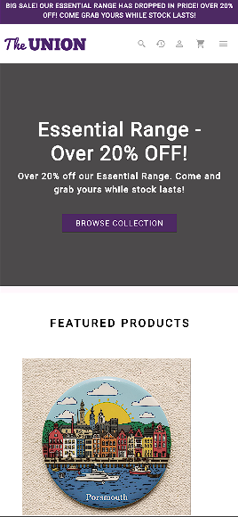
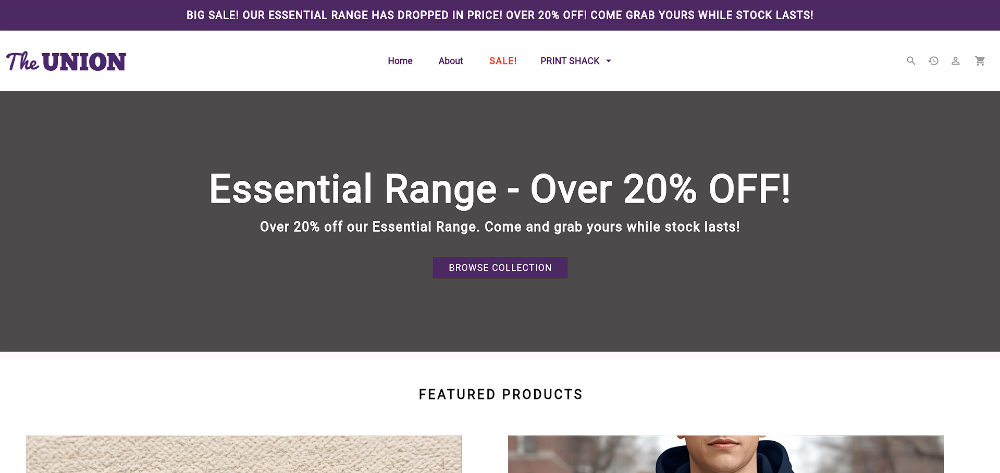

````markdown
# Union Shop - Flutter E-Commerce Application

A comprehensive e-commerce application built with Flutter, providing a complete shopping experience with product browsing, cart management, and product personalization features. This mobile-first application is optimized for web deployment with cross-platform compatibility.

[](https://flutter.dev)
[](https://dart.dev)
[](./test)
[](./)
[](LICENSE)

## 📋 Table of Contents

- [Features](#-features)
- [Screenshots](#-screenshots)
- [Getting Started](#-getting-started)
  - [Prerequisites](#prerequisites)
  - [Installation](#installation)
  - [Running the Application](#running-the-application)
  - [Testing](#testing)
- [Project Structure](#-project-structure)
- [Architecture & Design](#-architecture--design)
- [State Management](#-state-management)
- [Testing Strategy](#-testing-strategy)
- [Development Guidelines](#-development-guidelines)
- [Known Issues & Limitations](#-known-issues--limitations)
- [Future Enhancements](#-future-enhancements)
- [Contributing](#-contributing)
- [Contact & Support](#-contact--support)
- [Acknowledgments](#-acknowledgments)
- [License](#-license)
- [Project Information](#-project-information)

## ✨ Features

### 🛍️ Shopping Experience

- **Homepage** with featured products and collections
- **Collections Page** with categorized product organization
- **Individual Collection Pages** with product filtering
- **Product Detail Pages** with comprehensive product information
- **Dynamic Pricing Display** with quantity selectors

### 🛒 Shopping Cart System

- **Add/Remove Products** with selected options
- **Quantity Modifications** directly in cart
- **Real-time Price Calculations** with automatic updates
- **Persistent Cart State** across sessions
- **Order History Tracking** with purchase records

### 🎨 Print Shack Personalization

- **Custom Text Personalization** service
- **Product Customization Interface** with live preview
- **Multiple Personalization Options** for different products
- **Dynamic Price Updates** based on customizations
- **Personalized Items Management** in shopping cart

### 🔍 Search Functionality

- **Full-text Product Search** across all items
- **Real-time Search Results** with instant feedback
- **Search Overlay** accessible from header
- **Product Navigation** from search results

### 📱 Responsive Design

- **Mobile-first Approach** optimized for smartphones
- **Desktop-responsive Layouts** for wider screens
- **Adaptive Navigation** with intuitive menus
- **Flexible Grid Layouts** that adjust to screen size
- **Touch-friendly UI Elements** with proper sizing

### ℹ️ Informational Pages

- **About Us Page** with company information
- **Print Shack About Page** explaining personalization services
- **Comprehensive Footer** with navigation links and information
- **User Order History** tracking and display

## 📸 Screenshots

### 🏠 Homepage Experience




The homepage features a clean, modern design with intuitive navigation and featured product sections, optimized for both mobile and desktop viewing experiences.

### 🛍️ Product Browsing

**Collections Page**: Browse products organized by categories with easy navigation and clear product displays. Each collection shows relevant products with filtering options.

**Product Detail Page**: Comprehensive product information display with detailed descriptions, pricing, variant selection, and add-to-cart functionality.

### 🛒 Shopping Cart

**Cart Management**: Interactive shopping cart interface with real-time price updates, quantity adjustments, item removal, and order summary.

**Order History**: User order tracking with detailed purchase history, order status, and receipt information.

### 🎨 Print Shack Personalization

**Customization Interface**: User-friendly interface for product personalization with text input, design preview, and customization options.

**Personalized Products**: Customized products displayed in cart with specific personalization details and adjusted pricing.

### 📱 Responsive Design

The application provides optimal user experience across all device sizes with adaptive layouts, touch-friendly interfaces, and responsive design patterns.

## 🚀 Getting Started

### Prerequisites

Before you begin, ensure your system meets the following requirements:

#### Operating Systems Supported

- **Windows**: Windows 10 or later (64-bit)
- **macOS**: macOS 10.14 (Mojave) or later
- **Linux**: Any modern 64-bit Linux distribution

#### Hardware Requirements

- **Minimum**:
  - 4 GB RAM
  - 2 GB free disk space
  - 1280 x 800 screen resolution
- **Recommended**:
  - 8 GB RAM or more
  - 5 GB free disk space
  - 1920 x 1080 screen resolution

#### Required Software & Tools

##### 1. Flutter SDK (Version 3.0 or higher)

```bash
# Installation methods:

# macOS with Homebrew
brew install --cask flutter

# Linux
sudo snap install flutter --classic

# Windows
# Download from https://flutter.dev/docs/get-started/install/windows

# Verify installation
flutter --version
```
````

##### 2. Dart SDK (Version 2.17 or higher)

```bash
# Included with Flutter SDK
# Verify installation
dart --version
```

##### 3. Git Version Control

```bash
# Installation:

# macOS
brew install git

# Ubuntu/Debian
sudo apt-get install git

# Windows
# Download from https://git-scm.com/download/win

# Verify installation
git --version
```

##### 4. Code Editor (Choose one)

**Visual Studio Code (Recommended)**

- Download from https://code.visualstudio.com/
- Install Flutter and Dart extensions

**Android Studio**

- Download from https://developer.android.com/studio
- Install Flutter and Dart plugins

##### 5. Platform-Specific Requirements

**For Web Development:**

- Google Chrome 90+ or Microsoft Edge 90+
- Web server for testing (included with Flutter)

**For Android Development:**

- Java Development Kit (JDK) 11 or higher
- Android Studio
- Android SDK

**For iOS Development (macOS only):**

- Xcode 13+
- CocoaPods
- iOS Simulator or physical device

**For Windows Development:**

- Visual Studio 2019 or higher
- Windows 10 SDK

#### Verify Complete Installation

Run the following command to verify all components are properly installed:

```bash
flutter doctor -v
```

**Expected Output:**

```
[✓] Flutter (Channel stable, 3.x.x, on macOS/Windows/Linux)
[✓] Chrome - develop for the web
[✓] VS Code/Android Studio
[✓] Connected device
• No issues found!
```

### Installation

#### Step 1: Clone the Repository

```bash
# Clone using HTTPS
git clone https://github.com/Achilleas05/union_shop.git

# Navigate to project directory
cd union_shop

# Verify repository structure
ls -la
```

**Expected Repository Structure:**

```
union_shop/
├── lib/
├── test/
├── assets/
├── android/
├── ios/
├── web/
├── windows/
├── coverage/
├── pubspec.yaml
└── README.md
```

#### Step 2: Install Dependencies

```bash
# Install all Flutter packages
flutter pub get

# Upgrade dependencies to latest compatible versions
flutter pub upgrade
```

**Expected Output:**

```
Running "flutter pub get" in union_shop...
Resolving dependencies...
Got dependencies!
```

#### Step 3: Verify Project Setup

```bash
# Run static analysis
flutter analyze

# Check for formatting issues
dart format --output=none --set-exit-if-changed .

# Verify project configuration
flutter config
```

**Expected Analysis Output:**

```
Analyzing union_shop...
No issues found!
```

### Running the Application

#### Development Mode Options

##### **Option 1: Run on Web (Recommended for Development)**

```bash
# Basic web run
flutter run -d chrome

# With hot reload enabled
flutter run -d chrome --hot-reload

# With specific port
flutter run -d chrome --web-port=8080

# With debug mode
flutter run -d chrome --debug

# With release mode optimizations
flutter run -d chrome --release
```

##### **Option 2: Run on Android**

```bash
# Connect Android device or start emulator
flutter devices

# Run on connected device
flutter run -d android

# Run on specific device
flutter run -d <device_id>
```

##### **Option 3: Run on iOS (macOS only)**

```bash
# Open iOS simulator
open -a Simulator

# Run on iOS simulator
flutter run -d ios

# Run on connected iPhone
flutter run -d <iphone_device_id>
```

##### **Option 4: Run on Windows**

```bash
# Run on Windows
flutter run -d windows
```

#### Development Workflow Tips

1. **Hot Reload vs Hot Restart:**

   - Press `r` in terminal for **Hot Reload** (preserves state)
   - Press `R` in terminal for **Hot Restart** (resets state)
   - Press `d` to open **DevTools**
   - Press `q` to **quit** the application

2. **Debugging Tools:**

   ```bash
   # Open DevTools in browser
   flutter pub global activate devtools
   flutter pub global run devtools

   # Enable debug painting
   flutter run --debug-paint

   # Enable performance overlay
   flutter run --profile
   ```

### Viewing in Mobile Mode

Since this is a mobile-first application, it's important to test in mobile view:

#### Using Chrome DevTools

1. **Open DevTools:**

   - Right-click → **Inspect**
   - Press `F12` (Windows/Linux)
   - Press `Cmd+Option+I` (macOS)

2. **Enable Mobile View:**

   - Click **Toggle device toolbar** (📱 icon)
   - Or press `Ctrl+Shift+M` / `Cmd+Shift+M`

3. **Configure Device Settings:**
   - Recommended devices for testing:
     - iPhone 12 Pro (390x844)
     - iPhone SE (375x667)
     - Pixel 5 (393x851)
   - Custom dimensions:
     - Small mobile: 360x640
     - Medium mobile: 375x667
     - Large mobile: 414x896

#### Using Physical Devices

1. **Android:**

   ```bash
   # Enable USB debugging
   # Settings → Developer options → USB debugging

   # Check connected devices
   adb devices

   # Run on connected device
   flutter run -d <device_id>
   ```

2. **iOS:**

   ```bash
   # Connect via USB
   # Trust the computer on iPhone

   # Run on connected device
   flutter run -d <device_id>
   ```

#### Responsive Testing Checklist

- [ ] Test on at least 3 different screen sizes
- [ ] Verify touch targets are at least 44x44 pixels
- [ ] Check text readability on small screens
- [ ] Test landscape orientation
- [ ] Verify navigation works on all screen sizes
- [ ] Check image loading and scaling

### Running Tests

#### Test Suite Overview

The application includes a comprehensive test suite with:

- **Unit Tests**: Business logic and data model validation
- **Widget Tests**: UI component testing
- **Integration Tests**: User flow testing

#### Running Tests

##### **Basic Test Commands**

```bash
# Run all tests
flutter test

# Run tests with coverage report
flutter test --coverage

# Run tests in verbose mode
flutter test -v

# Run specific test file
flutter test test/models/product_test.dart

# Run tests in a directory
flutter test test/models/

# Run tests matching a pattern
flutter test --name="test cart operations"
```

##### **Test Categories**

1. **Model Tests:**

   ```bash
   flutter test test/models/
   # Tests data models, validation, and business logic
   ```

2. **Page Tests:**

   ```bash
   flutter test test/pages/
   # Tests UI screens and user interactions
   ```

3. **Widget Tests:**
   ```bash
   flutter test test/widgets/
   # Tests reusable UI components
   ```

#### Test Structure

```
test/
├── models/                          # Data model tests
│   ├── cart_test.dart              # Cart operations and validation
│   ├── collection_test.dart         # Collection logic and organization
│   ├── fixtures_test.dart          # Sample data generation and testing
│   ├── order_test.dart             # Order processing and history
│   └── product_test.dart           # Product model validation and pricing
├── pages/                          # Page/Screen tests
│   ├── about_page_test.dart        # About page UI and content
│   ├── cart_page_test.dart         # Cart page functionality and UI
│   ├── collection_page_test.dart   # Collection view interactions
│   ├── collections_page_test.dart  # Collections listing and navigation
│   ├── login_page_test.dart        # Login interface and validation
│   ├── print_shack_about_page_test.dart # Print Shack information display
│   └── print_shack_page_test.dart  # Product personalization interface
├── widgets/                        # Widget tests
│   ├── footer_test.dart            # Footer component rendering
│   ├── header_test.dart            # Header navigation and functionality
│   └── search_overlay_test.dart    # Search functionality and UI
├── home_test.dart                  # Homepage layout and features
├── product_test.dart               # Product display and interactions
└── widget_test.dart                # Basic widget testing framework
```

#### Test Coverage

##### **Generating Coverage Reports**

```bash
# Generate LCOV coverage report
flutter test --coverage

# Convert to HTML
genhtml coverage/lcov.info -o coverage/html

# View in browser
open coverage/html/index.html
```

##### **Coverage Goals**

- **Minimum**: 80% line coverage
- **Target**: 90% line coverage
- **Critical paths**: 100% coverage
- **UI components**: 85% coverage

### Hot Reload & Development Tools

#### Hot Reload vs Hot Restart

**Hot Reload (r):**

- Preserves application state
- Updates running code in under 1 second
- Maintains scroll position
- Keeps network connections active
- Best for styling and minor logic changes

**Hot Restart (R):**

- Resets application state
- Restarts the Flutter framework
- Takes 5-10 seconds
- Use when changing app initialization or routes

#### Development Workflow

1. **Start Development Server:**

   ```bash
   flutter run -d chrome --debug
   ```

2. **Make Code Changes:**

   - Edit Dart files in lib/
   - Save changes (Ctrl+S / Cmd+S)

3. **Observe Hot Reload:**

   - Changes appear immediately
   - State is preserved
   - No need to restart

4. **When Hot Reload Fails:**
   - Press `R` for Hot Restart
   - Or stop and restart: `q` then `flutter run`

#### Flutter DevTools

##### **Opening DevTools**

```bash
# Method 1: From terminal during flutter run
# Press 'd' to open DevTools

# Method 2: Standalone
flutter pub global activate devtools
flutter pub global run devtools

# Method 3: From VS Code
# Install Flutter extension
# Open Command Palette → "Flutter: Open DevTools"
```

##### **DevTools Features**

1. **Widget Inspector:**

   - Visual widget tree
   - Layout boundaries
   - Performance overlay

2. **Performance View:**

   - Frame rendering time
   - GPU/CPU usage
   - Memory profiling

3. **Memory Profiler:**

   - Heap snapshot
   - Memory allocation tracking
   - Leak detection

4. **Network Profiler:**

   - HTTP request tracking
   - Timeline visualization
   - Response inspection

5. **Logging View:**
   - Structured logs
   - Error tracking
   - Debug output

## 📁 Project Structure

```
union_shop/
├── lib/                             # Main application source code
│   ├── main.dart                   # Application entry point and routing
│   ├── models/                     # Data models and business logic
│   │   ├── cart.dart              # Shopping cart model and operations
│   │   ├── collection.dart        # Product collection model
│   │   ├── fixtures.dart          # Sample data generation and management
│   │   ├── order_history.dart     # Order history tracking and management
│   │   ├── order.dart             # Order model and processing logic
│   │   └── product.dart           # Product model with pricing and details
│   ├── pages/                      # Application screens and views
│   │   ├── about_page.dart        # About Us information page
│   │   ├── cart_page.dart         # Shopping cart interface
│   │   ├── collection_page.dart   # Individual collection view
│   │   ├── collections_page.dart  # All collections listing
│   │   ├── login_page.dart        # User login interface
│   │   ├── order_history_page.dart # User order history display
│   │   ├── print_shack_about_page.dart # Print Shack service information
│   │   ├── print_shack_page.dart  # Product personalization interface
│   │   └── product_page.dart      # Product detail view
│   └── widgets/                    # Reusable UI components
│       ├── footer.dart            # Application footer with links
│       ├── header.dart            # Navigation header with search
│       └── search_overlay.dart    # Search functionality overlay
├── test/                           # Comprehensive test suite
│   ├── models/                    # Data model tests
│   │   ├── cart_test.dart        # Cart functionality tests
│   │   ├── collection_test.dart  # Collection model tests
│   │   ├── fixtures_test.dart    # Sample data tests
│   │   ├── order_test.dart       # Order processing tests
│   │   └── product_test.dart     # Product model validation
│   ├── pages/                    # Page/Screen tests
│   │   ├── about_page_test.dart      # About page UI tests
│   │   ├── cart_page_test.dart       # Cart page functionality tests
│   │   ├── collection_page_test.dart # Collection view tests
│   │   ├── collections_page_test.dart # Collections listing tests
│   │   ├── login_page_test.dart      # Login interface tests
│   │   ├── print_shack_about_page_test.dart # Print Shack info tests
│   │   └── print_shack_page_test.dart # Personalization interface tests
│   ├── widgets/                  # Widget component tests
│   │   ├── footer_test.dart     # Footer rendering tests
│   │   ├── header_test.dart     # Header functionality tests
│   │   └── search_overlay_test.dart # Search overlay tests
│   ├── home_test.dart           # Homepage tests
│   ├── product_test.dart        # Product display tests
│   └── widget_test.dart         # Basic widget tests
├── assets/                       # Images, fonts, and static resources
│   ├── home-mobile.png          # Mobile homepage screenshot
│   ├── home-desktop.png         # Desktop homepage screenshot
│   └── [other assets]           # Additional images and resources
├── android/                     # Android-specific configuration
├── ios/                         # iOS-specific configuration
├── web/                         # Web-specific configuration and assets
├── windows/                     # Windows-specific configuration
├── linux/                       # Linux-specific configuration
├── macos/                       # macOS-specific configuration
├── .gitignore                   # Git ignore rules
├── analysis_options.yaml        # Dart/Flutter analysis configuration
├── pubspec.yaml                 # Dependencies and project metadata
├── pubspec.lock                 # Locked dependency versions
├── README.md                    # This documentation file
├── requirements.md              # Project requirements specification
├── prompt.md                    # AI prompt documentation
└── flutter_01.log               # Flutter build and runtime logs
```

### Key File Descriptions

#### **lib/main.dart**

The main entry point of the application. Contains:

- Application initialization
- Routing configuration
- Theme setup
- Main application widget structure

#### **lib/models/**

**cart.dart**: Manages shopping cart operations including:

- Adding and removing items
- Quantity adjustments
- Price calculations
- Cart state persistence

**collection.dart**: Defines product collection structure:

- Collection organization
- Product categorization
- Collection metadata management

**fixtures.dart**: Provides sample data for:

- Development and testing
- Demo purposes
- Product and collection data

**product.dart**: Core product model with:

- Product attributes and details
- Pricing and inventory logic
- Image and description handling

**order.dart**: Order processing logic:

- Order creation and management
- Order status tracking
- Order history functionality

**order_history.dart**: User order history management:

- Historical order retrieval
- Order display and organization
- Purchase tracking

#### **lib/pages/**

**about_page.dart**: Company information and about page content.

**cart_page.dart**: Shopping cart interface with:

- Cart item display
- Quantity modification
- Price calculations
- Checkout initiation

**collection_page.dart**: Individual collection view with product listings.

**collections_page.dart**: All collections listing page.

**login_page.dart**: User login interface.

**order_history_page.dart**: User order history display.

**print_shack_about_page.dart**: Print Shack service information.

**print_shack_page.dart**: Product personalization interface.

**product_page.dart**: Detailed product view.

#### **lib/widgets/**

**header.dart**: Main navigation header with logo and navigation.

**footer.dart**: Application footer with links and information.

**search_overlay.dart**: Search functionality interface.

## 🏗️ Architecture & Design

### Design Patterns

#### **Provider Pattern**

Used for state management throughout the application:

- **Cart State Management**: Real-time cart updates
- **UI State Management**: Theme and preferences
- **Data State Management**: Product and collection data

#### **Repository Pattern**

Data abstraction layer for managing application data:

- **Local Data Management**: In-memory data handling
- **Fixture Data Source**: Sample data provision
- **Future API Integration**: Prepared for external services

#### **Service Layer Architecture**

Business logic separation into dedicated classes:

- **Cart Service**: Shopping cart operations
- **Product Service**: Product management
- **Order Service**: Order processing

### State Management Strategy

#### **Local State Management**

- **StatefulWidget**: For component-specific state
- **InheritedWidget**: For theme propagation
- **ValueNotifier**: For reactive UI updates

#### **Application State Management**

- **ChangeNotifier**: For cart and data state
- **Stream-based Updates**: For real-time changes
- **Persistent Storage**: For user preferences

### Component Architecture

#### **Reusable Widget Components**

- **Stateless Widgets**: Pure presentation components
- **Stateful Widgets**: Interactive components
- **Compound Widgets**: Complex UI elements

#### **Page Architecture**

- **Single Responsibility**: Each page handles specific functionality
- **Consistent Patterns**: Uniform navigation patterns
- **Modular Design**: Easy feature addition

### Navigation Architecture

#### **Page-based Navigation**

- Clear separation between different views
- Efficient data transfer between screens
- Proper navigation history handling

#### **Route Management**

- Centralized route configuration
- Parameter passing between pages
- Back stack management

## 💾 State Management

### Implementation Details

#### **Cart State Management**

The shopping cart uses a centralized state management approach:

- Real-time price calculations
- Quantity updates with validation
- Cart persistence across sessions
- Order history tracking

#### **Product State Management**

Product data is managed through:

- Local fixture data source
- Efficient caching strategies
- Search and filtering capabilities
- Category-based organization

### State Persistence

#### **Local Storage**

- In-memory state management during session
- Future-ready for persistent storage integration
- Efficient data retrieval and updates

#### **User Preferences**

- Theme preferences management
- Display settings
- Future user-specific preferences

## 🧪 Testing Strategy

### Test Categories

#### **Unit Tests**

- Data model validation
- Business logic testing
- Utility function testing

#### **Widget Tests**

- UI component rendering
- User interaction testing
- Responsive design testing

#### **Integration Tests**

- User flow testing
- Navigation testing
- End-to-end functionality

### Testing Best Practices

#### **Test Structure**

- Clear test naming conventions
- Comprehensive test coverage
- Efficient test organization

#### **Test Data Management**

- Fixture data for testing
- Mock data generation
- Test data isolation

### Continuous Integration

#### **Automated Testing**

- GitHub Actions integration ready
- Automated test execution
- Coverage reporting

#### **Quality Assurance**

- Code analysis integration
- Formatting validation
- Performance testing

## 💻 Development Guidelines

### Code Style

#### **Dart Style Guide**

This project follows the official [Dart Style Guide](https://dart.dev/guides/language/effective-dart/style) and uses `analysis_options.yaml` for static analysis.

```bash
# Analyze code
flutter analyze

# Format code
dart format lib/ test/

# Fix auto-fixable issues
dart fix --apply
```

#### **Naming Conventions**

- **Classes**: PascalCase (e.g., `ShoppingCart`)
- **Variables**: camelCase (e.g., `itemCount`)
- **Constants**: UPPER_SNAKE_CASE (e.g., `MAX_ITEMS`)
- **Files**: snake_case (e.g., `cart_page.dart`)

### Development Workflow

#### **Feature Development**

1. Create feature branch: `git checkout -b feature/feature-name`
2. Implement feature with tests
3. Ensure tests pass: `flutter test`
4. Ensure no analysis issues: `flutter analyze`
5. Format code: `dart format .`
6. Commit changes: `git commit -m "feat: description"`
7. Push and create pull request

#### **Commit Message Convention**

Follow conventional commits:

- `feat:` New feature
- `fix:` Bug fix
- `docs:` Documentation changes
- `test:` Adding or updating tests
- `refactor:` Code refactoring
- `style:` Code style changes (formatting)
- `chore:` Maintenance tasks

### Performance Optimization

#### **Build Optimization**

```bash
# Analyze build size
flutter build apk --analyze-size

# Build for release
flutter build apk --release
```

#### **Performance Monitoring**

- Use Flutter DevTools for profiling
- Monitor widget rebuilds
- Optimize image loading
- Implement lazy loading

## 🐛 Known Issues & Limitations

### Current Limitations

1. **Local Data Only**: Currently uses fixture data without external API integration
2. **No Payment Processing**: Checkout flow is simulated without real payment integration
3. **Basic Authentication**: Simple login interface without advanced security features
4. **Limited Offline Support**: Primarily designed for online usage

### Technical Constraints

1. **Web-Focused Development**: Optimized for web with mobile and desktop support
2. **Fixture-Based Data**: Uses local sample data for product catalog
3. **Basic State Management**: Uses Provider pattern without advanced state management libraries

## 🔮 Future Enhancements

### Planned Features

1. **External API Integration**

   - Real product data from e-commerce APIs
   - User authentication with backend service
   - Live inventory management

2. **Advanced Features**

   - Payment gateway integration (Stripe, PayPal)
   - User reviews and ratings system
   - Wishlist functionality
   - Product recommendations

3. **Enhanced User Experience**

   - Advanced search filters
   - Product comparison tool
   - Saved carts and frequent purchases
   - Multi-language support

4. **Administrative Features**
   - Admin dashboard for product management
   - Order management system
   - Analytics and reporting
   - Customer management tools

### Technical Improvements

1. **State Management Upgrade**

   - Migration to Riverpod or Bloc for advanced state management
   - Improved data persistence
   - Real-time updates

2. **Performance Optimizations**

   - Advanced caching strategies
   - Image optimization and lazy loading
   - Code splitting for faster loads

3. **Security Enhancements**
   - Advanced authentication mechanisms
   - Data encryption
   - Secure payment processing

## 🤝 Contributing

Contributions are welcome! Please follow these guidelines:

### How to Contribute

1. **Fork the Repository**

   ```bash
   # Fork on GitHub, then clone your fork
   git clone https://github.com/Achilleas05/union_shop.git
   cd union_shop
   ```

2. **Create a Feature Branch**

   ```bash
   git checkout -b feature/amazing-feature
   ```

3. **Make Your Changes**

   - Write clear, well-documented code
   - Add tests for new functionality
   - Follow existing code style and patterns

4. **Test Your Changes**

   ```bash
   # Run all tests
   flutter test

   # Check code analysis
   flutter analyze

   # Format code
   dart format .
   ```

5. **Commit Your Changes**

   ```bash
   git add .
   git commit -m "feat: add amazing feature"
   ```

6. **Push to Your Fork**

   ```bash
   git push origin feature/amazing-feature
   ```

7. **Open a Pull Request**
   - Navigate to the original repository
   - Click "New Pull Request"
   - Select your feature branch
   - Provide a clear description of your changes

### Contribution Guidelines

#### **Code Quality**

- Write tests for all new functionality
- Ensure code passes static analysis
- Follow existing architecture patterns
- Document complex logic

#### **Documentation**

- Update README.md for new features
- Document API changes
- Add code comments for complex logic
- Update test documentation

#### **Issue Reporting**

- Use GitHub Issues for bug reports
- Provide detailed reproduction steps
- Include screenshots for UI issues
- Specify environment details

## 📞 Contact & Support

### Developer Information

**Achilleas Achilleos**

- GitHub: [@Achilleas05](https://github.com/Achilleas05)
- Repository: [github.com/Achilleas05/union_shop](https://github.com/Achilleas05/union_shop)

### Getting Help

For questions or issues:

1. **Bug Reports**

   - Use [GitHub Issues](https://github.com/Achilleas05/union_shop/issues)
   - Include detailed description and steps to reproduce
   - Add relevant screenshots or error messages

2. **Feature Requests**

   - Submit via GitHub Issues with `enhancement` label
   - Describe the feature and its benefits
   - Include potential implementation ideas

3. **Questions & Discussions**
   - Use GitHub Issues for general questions
   - Provide context about your use case
   - Include relevant code snippets

### Community & Support

- **Documentation**: This README and code comments
- **Examples**: Test files and sample implementations
- **Troubleshooting**: Common issues section in this README

## 🙏 Acknowledgments

### Credits & Thanks

- **Flutter Team** for the excellent framework and comprehensive documentation
- **Dart Community** for amazing packages and development tools
- **University of Portsmouth** for the coursework inspiration and guidance
- **Open Source Community** for invaluable resources and support
- **Test Contributors** for helping improve code quality
- **Beta Testers** for providing valuable feedback

### Resources Used

- **Flutter Documentation**: https://flutter.dev/docs
- **Dart Language Tour**: https://dart.dev/guides/language/language-tour
- **Provider Package**: https://pub.dev/packages/provider
- **Flutter Testing**: https://flutter.dev/docs/testing

## 📝 Project Information

### Academic Context

**Course**: Programming Applications and Programming Languages / User Experience Design and Implementation
**Institution**: University of Portsmouth
**Academic Year**: 2024-2025
**Project Type**: Coursework Assessment

### Project Goals

1. **Educational Objectives**

   - Demonstrate proficiency in Flutter and Dart
   - Implement modern software architecture patterns
   - Create responsive, user-friendly applications
   - Apply testing and quality assurance practices

2. **Technical Objectives**

   - Build a complete e-commerce application
   - Implement state management solutions
   - Create reusable UI components
   - Develop comprehensive test suites

3. **Learning Outcomes**
   - Mobile-first application development
   - Cross-platform deployment strategies
   - Software documentation practices
   - Project management and version control

### Project Timeline

- **Planning Phase**: Requirements analysis and architecture design
- **Development Phase**: Implementation of core features and UI
- **Testing Phase**: Unit, widget, and integration testing
- **Documentation Phase**: README, code comments, and user guides
- **Deployment Phase**: Web deployment and platform builds

### Future Development

This project serves as a foundation for:

- Advanced e-commerce features
- Real API integrations
- Enhanced user experiences
- Scalable architecture patterns

---

**Built with ❤️ using Flutter**

_Thank you for checking out Union Shop! We hope this project provides value for learning Flutter development and e-commerce application design._

```

```
